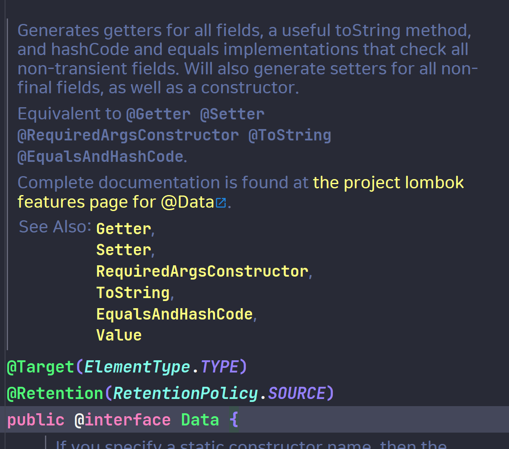

# Decompiled code
```java
public class DataAntiPattern {
    private String name;
    private int age;

    public DataAntiPattern() {
    }

    public String getName() {
        return this.name;
    }

    public int getAge() {
        return this.age;
    }

    public void setName(final String name) {
        this.name = name;
    }

    public void setAge(final int age) {
        this.age = age;
    }

    public boolean equals(final Object o) {
        if (o == this) {
            return true;
        } else if (!(o instanceof DataAntiPattern)) {
            return false;
        } else {
            DataAntiPattern other = (DataAntiPattern)o;
            if (!other.canEqual(this)) {
                return false;
            } else if (this.getAge() != other.getAge()) {
                return false;
            } else {
                Object this$name = this.getName();
                Object other$name = other.getName();
                if (this$name == null) {
                    if (other$name != null) {
                        return false;
                    }
                } else if (!this$name.equals(other$name)) {
                    return false;
                }

                return true;
            }
        }
    }

    protected boolean canEqual(final Object other) {
        return other instanceof DataAntiPattern;
    }

    public int hashCode() {
        int PRIME = true;
        int result = 1;
        result = result * 59 + this.getAge();
        Object $name = this.getName();
        result = result * 59 + ($name == null ? 43 : $name.hashCode());
        return result;
    }

    public String toString() {
        String var10000 = this.getName();
        return "DataAntiPattern(name=" + var10000 + ", age=" + this.getAge() + ")";
    }
}

```

# Data Annotation Anti-Pattern

## Description

롬복의 `@Data` 어노테이션은 클래스에 대한 `toString()`, `equals()`, `hashCode()`, 그리고 `getter`/`setter` 메소드를 자동으로 생성합니다. 이는 코드를 매우 간결하게 만들지만, 다음과 같은 문제점들을 야기할 수 있습니다.

## Problems

1. **Unexpected Side Effects**:
   - `equals()`와 `hashCode()` 메소드가 모든 필드를 사용하여 생성되므로, 예상치 못한 사이드 이펙트가 발생할 수 있습니다. 특히, 컬렉션 내 객체 비교 시 문제가 발생할 수 있습니다.
   - @Data 어노테이션은 직렬화를 고려하지 않은 equals()와 hashCode()를 생성할 수 있습니다. 이는 직렬화 가능한 클래스에서 문제를 일으킬 수 있습니다. 객체의 일부 필드가 직렬화에 적합하지 않은 경우, 자동 생성된 메소드들은 예상치 못한 방식으로 동작할 수 있습니다.

2. **Performance Issues**:
   - `toString()` 메소드가 모든 필드를 출력하도록 생성되기 때문에, 대규모 데이터를 가진 객체에서 성능 저하가 일어날 수 있습니다.
   - JPA 엔티티에서는 연관 관계로 인해 무한 루프가 발생할 수 있습니다.

3. **Encapsulation Breach**:
   - 모든 필드에 대한 `getter`와 `setter`가 생성되므로, 객체의 캡슐화가 위반될 수 있습니다. 이는 객체의 무결성을 해칠 수 있습니다.
   - 모든 필드에 대해 setter를 생성하면, 불변성이 필요한 필드도 변경할 수 있게 됩니다. 이는 클래스의 데이터 무결성을 위협할 수 있으며, 객체가 예상치 못한 상태로 변경될 위험이 있습니다.
   - @Data 어노테이션을 사용한 클래스는 상속에 문제를 일으킬 수 있습니다. 자동 생성된 equals()와 hashCode() 메소드는 상속받은 클래스에서 적절히 동작하지 않을 수 있으며, 이는 객체 비교와 해시 기반 컬렉션 사용에 문제를 일으킬 수 있습니다.

4. **Reduced Code Explicitness**:
   - 자동 생성된 메소드들은 코드에서 명시적으로 보이지 않기 때문에, 코드의 가독성과 이해도가 감소할 수 있습니다. 특히, 큰 프로젝트나 여러 개발자가 협업하는 환경에서 이러한 문제가 두드러질 수 있습니다.

## Solutions

- 필요한 메소드만 명시적으로 선언하는것이 가장 좋습니다.
- 성능에 민감한 부분에서는 `toString()`이나 `equals()`의 구현을 직접 제어합니다.
- 캡슐화를 유지하기 위해 필요하지 않은 필드에는 `setter`를 생성하지 않습니다.
- `@Data` 대신 `@Getter`, `@ToString`, `@EqualsAndHashCode` 등 필요한 어노테이션을 개별적으로 사용합니다.
